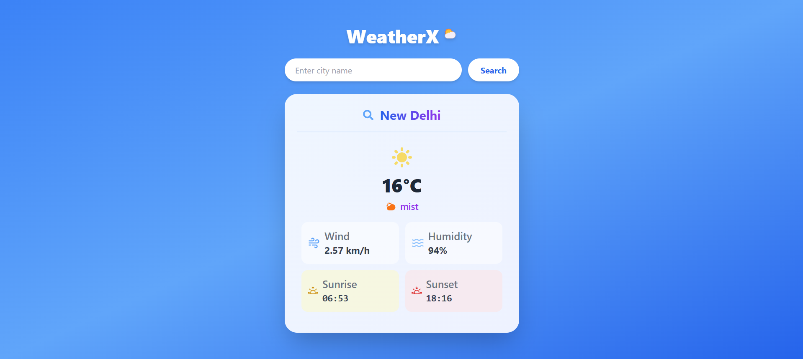

# WeatherX 🌤️  

**WeatherX** is a lightweight and responsive weather application designed to provide real-time weather updates for cities across India. It fetches accurate data using the OpenWeather API and presents it in an easy-to-read format.  

## Features  
✅ Live weather updates for Indian cities  
✅ Displays temperature, humidity, and wind speed  
✅ Sunrise & sunset timings  
✅ User-friendly and responsive UI  
✅ Fast and lightweight with minimal dependencies  
✅ Supports metric units for easy readability  

## Preview  
Check out how **WeatherX** looks in action:  

## Tech Stack  
- **Frontend:** React.js  
- **Styling:** Tailwind CSS  
- **API:** OpenWeather API  
- **Icons:** React Icons  

## Setup Instructions  
1. Clone the repository and navigate to the project folder.  
2. Install all required dependencies using:  
   `npm install`
3. Get a free API key from OpenWeather.
4. Replace the API key in WeatherCard.jsx.
5. Start the development server:
`npm run dev` 
Open http://localhost:5173/ in your browser to view the app.

## Future Enhancements  
🔹 Weekly weather forecast  
🔹 Location-based weather detection  
🔹 Dark mode support  
🔹 Improved UI animations  
🔹 Air quality index display  

## Troubleshooting  
- If the API request fails, ensure your API key is correct and not expired.  
- Make sure you have an active internet connection while fetching data.  
- If styling appears broken, verify that Tailwind CSS is properly configured.  

## Contributing  
Want to enhance **WeatherX**? Feel free to contribute by improving the UI, adding new features, or optimizing the code. Fork the repo and submit a pull request!  
